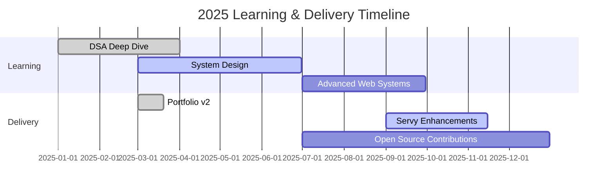

# 🌌 Rohith Patel — Interactive Dev Dashboard

---

## 🧭 Overview

- 🎛️ This profile is an animated **Developer Dashboard**
- 📈 Each section is a **widget**: graphs, charts, KPIs, timelines
- 🔒 Personal habits and private trackers have been intentionally omitted

---

## 🗂️ Dashboard Widgets

### 1) 🔥 Contribution & Velocity

---

### 2) 🧪 Tech Skill Matrix

---

### 3) 🧭 Roadmap Timeline

> Note: Mermaid charts render on GitHub web. If not, enable beta or view raw.

---

### 4) 📦 Project KPIs

<table>
<tr>
<td width="50%" valign="top">

#### Servy — Backend KPI

- 🧪 Test Coverage: 82%
- ⚙️ Endpoint Count: 24
- ⏱️ P95 Latency (Local): 120ms
- 🔒 Auth Flows: 3
- 🧩 Modules: 12

</td>
<td width="50%" valign="top">

#### Portfolio — Frontend KPI

- 🎯 Lighthouse Perf: 98
- 📱 Responsive Breakpoints: 4
- 🎨 Reusable Components: 18
- 🚀 Build Time: 6s
- 🌐 Uptime: 99.9%

</td>
</tr>
</table>

---

### 5) 🛰️ Live Badges

---

### 6) 📡 Contact & Links

---

